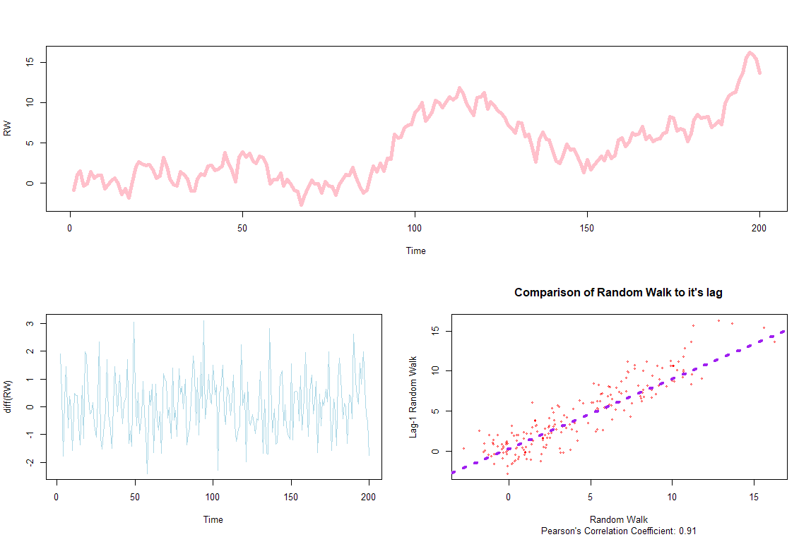
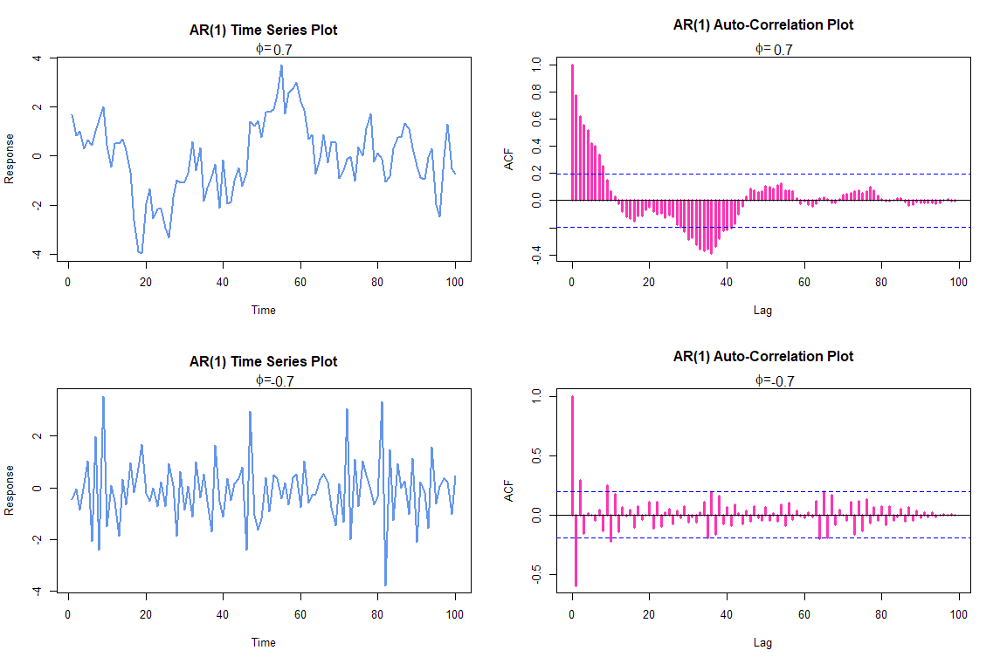
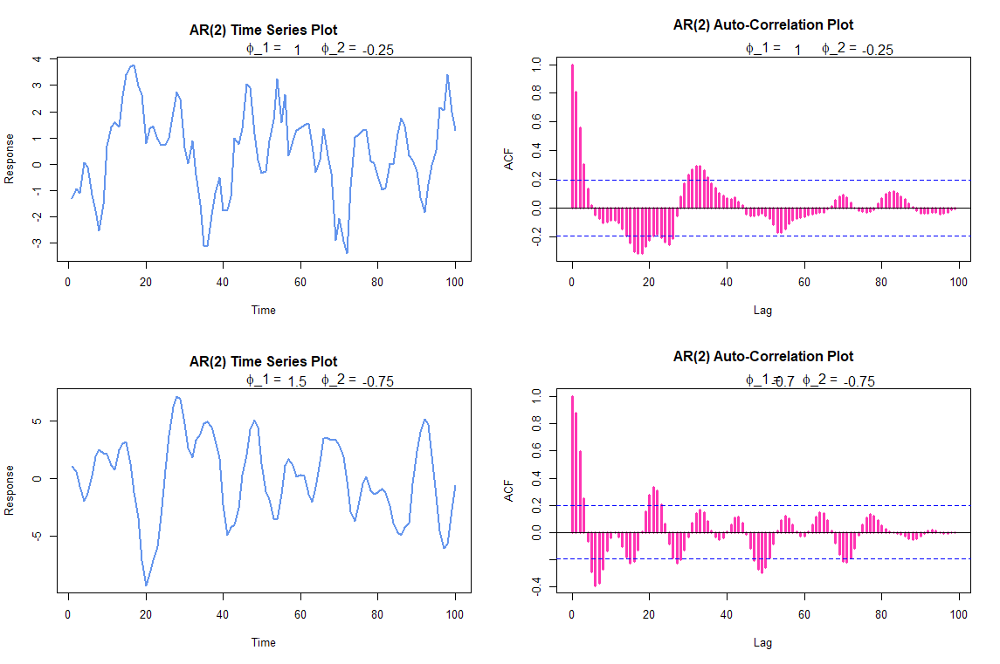
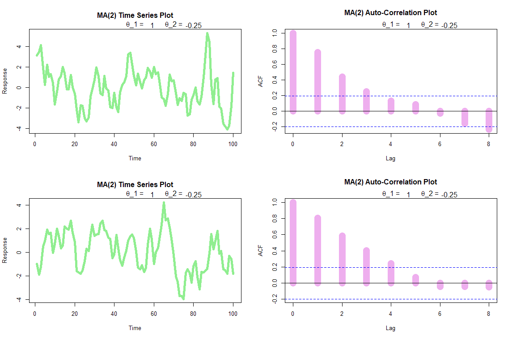

# Introduction

These models are for stationary time series, the ARIMA Model however is
for either stationary or non-stationary.

In the discussion below, the following variables are used:

  Variable                                      Description
  --------------------------------------------- ---------------------------------------------------------
  [$t$]{.math .inline}                          The relevant point in the Time Series
  [$Z_{t}$]{.math .inline}                      The Time Series Value (Response/Observation)
  [$\varepsilon_{t}$]{.math .inline}            The White noise for the corresponding time value.
  [$\sigma_{\varepsilon}^{2}$]{.math .inline}   The variance of the White Noise
  [$\phi$]{.math .inline}                       The slope of the last observation used in an AR process
  [$\theta$]{.math .inline}                     The slope of the last error used in an MA process
  [$\mu$]{.math .inline}                        Is the mean value

# Autocorrelation

Autocorrelation helps us see how each time series observation is related
to its recent past, (e.g. temperature would have autocorrelation, but
rolling a die would not).

Processes with greater autocorrelation are more predictable than those
with none. [^1^](#fn1){#fnref1 .footnote-ref}

This can be
automated with the acf() function, (the acf() function uses
[$1/n\ $]{.math .inline} which is preferable in time series, whereas
cor() uses [$\frac{1}{n - 1}$]{.math .inline} which adjusts for sampling
bias.)

# White Noise

White noise can be created in R with the ARIMA package:

::: {#cb1 .sourceCode data-language="r"}
``` {.sourceCode .r}
WN_1 <- (arima.sim(model=list(order=c(0,0,0)), n=50) %>% as.xts())
WN_1 <- as.xts(WN_1)

#To specify mean value or sd:
WN_1 <- arima.sim(model=list(order=c(0,0,0)), n=50, mean=0, sd=1)
```
:::

A white noise model can be fitted to some time series ([$Z$]{.math
.inline}) data by:

::: {#cb2 .sourceCode data-language="r"}
``` {.sourceCode .r}
arima(y, order=c(0,0,0))
```
:::

\[language=r\]

# Random Walk

A random walk is:

[$$Today = Yesterday + Noise$$]{.math .display}

More formally:

[$$Y_{t} = Y_{t - 1} + \varepsilon_{t}$$]{.math .display}

It is an AR process with [$\phi = 1$]{.math .inline}

## Simulating in R

White noise can be created in R with the cumsum()command, or,

White noise can be created in R with the ARIMA package:

::: {#cb3 .sourceCode data-language="r"}
``` {.sourceCode .r}
RW\_1 \textless- arima.sim(model=list(order=c(0,1,0)), n=50)

as.xts(RW\_1)

\#To specify mean value or sd:

RW\_1 \textless- arima.sim(model=list(order=c(0,1,0)), n=50, mean=0,
sd=1)
```
:::

\[language=r\]

A Random Walk model can be fitted to some time series ([$Z$]{.math
.inline}) data by:

::: {#cb4 .sourceCode data-language="r"}
``` {.sourceCode .r}
arima(y, order=c(0,1,0))
```
:::

\[language=r\]

# Autoregressive Process (AR)

A time series is said to be an autoregressive process of order
[$p$]{.math .inline} if it is a weighted linear sum of the past
[$p$]{.math .inline} values plus a random shock so:[^2^](#fn2){#fnref2
.footnote-ref} 3.11

A first order AR Process [$\mathbf{AR(1)}$]{.math .inline} is:

[$$Today = Slope \times Yesterday + Constant + Noise$$]{.math .display}

More formally:

[$$Y_{t} = \phi \bullet Z_{t - 1} + \varepsilon_{t}$$]{.math .display}

A second order AR process
[$(\mathbf{\text{AR}}\left( \mathbf{2} \right))$]{.math .inline} is:

[$$Y_{t} = \phi_{t - 1} \bullet Y_{t - 1} + \phi_{2} \bullet Y_{t - 2} + \varepsilon_{t}$$]{.math
.display}

A [$p^{\text{th}}$]{.math .inline} order AR Process
([$\mathbf{AR(p)}$]{.math .inline}) is:

[$$Y_{t} = \phi_{t - 1} \bullet Y_{t - 1} + \phi_{t - 2} \bullet Y_{t - 2} + \phi_{t - 3} \bullet Y_{t - 3}\ldots\phi_{t - p} \bullet Y_{t - p}$$]{.math
.display}

The focus here is on lower order Processes.

## Mean Centred Version

The Mean-centred ([$AR(1)$]{.math .inline}) version, which is used in R:

[$$\left( Today - Mean \right) = Slope \times \left( Yesterday - Mean \right) + Noise$$]{.math
.display}

So formally:

[$$\left( Y_{t} - \mu \right) = \phi\left( Y_{t - 1} - \mu \right) + \varepsilon_{t}$$]{.math
.display}

## Parameters

The mean centred autoregressive model has three parameters:

-   [$\mu$]{.math .inline} the mean

-   [$\phi$]{.math .inline} the slope

-   [$\sigma_{\varepsilon}^{2}$]{.math .inline} the variance of the
    white noise

## Stationarity and Auto-correlation for AR(1) and AR(2)

### AR(1)

An AR(1) process:

[$$Y_{t} = \phi \bullet Z_{t - 1} + \varepsilon_{t}$$]{.math .display}

+-----------------------------------+-----------------------------------+
| ::: {#auto-correlation}           | ::: {#stationarity}               |
| #### Auto Correlation             | #### Stationarity                 |
| :::                               | :::                               |
|                                   |                                   |
| Has an Auto-correlation function: | Is stationary if and only         |
|                                   | if:[^3^](#fn3){#fnref3            |
| [$$\rho_{k} = \phi^{k},\ \text{f  | .footnote-ref}                    |
| or\ }k = 0,\ 1,2,3\ldots$$]{.math |                                   |
| .display}                         | [$                                |
|                                   | $\left| \phi \right| < 1$$]{.math |
|                                   | .display}                         |
+===================================+===================================+
+-----------------------------------+-----------------------------------+

## AR(2)

An AR(2) process:

[$$Y_{t} = \phi_{t - 1}Y_{t - 1} + \phi_{2}Y_{t - 2} + \varepsilon_{t}$$]{.math
.display}

+-----------------------------------+-----------------------------------+
| ::: {#auto-correlation-1}         | ::: {#stationarity-1}             |
| #### Auto Correlation             | #### Stationarity                 |
| :::                               | :::                               |
|                                   |                                   |
| Has an Auto-correlation function: | Is stationary if and only if all  |
|                                   | three conditions are true:        |
| [$${\rho_{1                       |                                   |
| } = \frac{\phi_{1}}{1 - \phi_{2}} | [$${\left(                        |
| }{\rho_{2} = \phi_{1} \b          | \phi_{1} + \phi_{2} \right) < 1\  |
| ullet \rho_{1} + \phi_{2}\rho_{0} | }{\left                           |
| }{= \frac{\phi_{2}\le             | ( \phi_{2} - \phi_{1} \right) < 1 |
| ft( 1 - \phi_{2} \right) + \phi_{ | }{\text{\ \ }\lef                 |
| 1}^{2}}{(1 - \phi_{2})}}$$]{.math | t| \phi_{2} \right| < 1}$$]{.math |
| .display}                         | .display}                         |
|                                   |                                   |
| [$$\ldots$$]{.math .display}      |                                   |
|                                   |                                   |
| [$$\rho_{k} = \phi_{1}\rho_{k - 1 |                                   |
| } + \phi_{2}\rho_{k - 2}$$]{.math |                                   |
| .display}                         |                                   |
+===================================+===================================+
+-----------------------------------+-----------------------------------+

## Plots

### AR(1)

#### Slope

-   Zero slope [$\phi = 0$]{.math .inline}

    -   A slope of zero ([$\phi = 0$]{.math .inline}) is a white noise
        function.

    -   A non-zero slope [$\left( \phi \neq 0 \right)$]{.math .inline}
        means [$Y_{t}$]{.math .inline} is dependent on
        [$\varepsilon_{t}$]{.math .inline} and [$Y_{t - 1}$]{.math
        .inline}

-   A slope of 1 ([$\phi = 1$]{.math .inline}) is a random walk
    function.

-   Larger slope values ([$\phi)$]{.math .inline} imply larger auto
    correlation

-   Negative [$\phi$]{.math .inline} values results in oscillatory
    behaviour

    -   Because a preceeding positive value will result in a negative
        value following and vice versa

Observe that a larger [$\phi$]{.math .inline} leads to greater
persistence and a negative [$\phi$]{.math .inline} leads to oscillatory
behaviour:



### AR(2)



## Simulating Models in R

## AR(1)

The arima.sim() function can simulate a first order autoregressive
function like so:

arima.sim(model = list(ar=phi), n)

## AR(2)

The arima.sim() function can simulate a first order autoregressive
function like so:

arima.sim(model = list( ar=c(phi1, phi2) ), n)

# Moving Average Process

A time series is said to be a moving average process of order
[$q$]{.math .inline} if it is a weighted linear sum of the last
[$q$]{.math .inline} random shocks so that:[^4^](#fn4){#fnref4
.footnote-ref}

A first order MA Process [$\mathbf{MA(1)}$]{.math .inline} is:

[$$Today = Mean + Noise + Slope \times \left( \text{Yesterda}y^{'}\text{s\ Noise} \right)$$]{.math
.display}

More formally:

[$$Y_{t} = \mu + \varepsilon_{t} + \theta \bullet \varepsilon_{t - 1}$$]{.math
.display}

A first order MA Process [$\mathbf{MA(1)}$]{.math .inline} in the
lecture notes is provided as:

[$$Today = Noise + Slope \times \left( \text{Yesterda}y^{'}\text{s\ Noise} \right)$$]{.math
.display}

More formally:

[$$Y_{t} = \theta \bullet \varepsilon_{t - 1} + \varepsilon_{t}$$]{.math
.display}

A second order MA process (**MA**[$\left( \mathbf{2} \right))$]{.math
.inline} is:

[$$Y_{t} = \theta_{1} \bullet \varepsilon_{t - 1} + \theta_{2} \bullet \varepsilon_{t - 2} + \varepsilon_{t}$$]{.math
.display}

A [$p^{\text{th}}$]{.math .inline} order MA Process
([$\mathbf{MA(q)}$]{.math .inline}) is:[^5^](#fn5){#fnref5
.footnote-ref}

[$$Y_{t} = \theta_{1} \bullet \varepsilon_{t - 1} + \theta_{2} \bullet \varepsilon_{t - 2} + \ \theta_{3} \bullet \varepsilon_{t - 3} + \ldots\theta_{q} \bullet \varepsilon_{t - q} + \varepsilon_{t}$$]{.math
.display}

Some authors use the equation of the following equivalent
form:[^6^](#fn6){#fnref6 .footnote-ref}

[$$Y_{t} = \varepsilon_{t} - \theta_{1} \bullet \varepsilon_{t - 1} - \theta_{2} \bullet \varepsilon_{t - 2} - \ \theta_{3} \bullet \varepsilon_{t - 3}\ldots{- \theta}_{q} \bullet \varepsilon_{t - q}$$]{.math
.display}

The focus here is on lower order Processes.

## Parameters

There are three parameters to a moving average process:

-   [$\mu$]{.math .inline} is the mean value

-   [$\theta$]{.math .inline} is the slope value

-   [$\sigma_{\varepsilon}^{2}$]{.math .inline} is the White noise
    variance.

## Stationarity and Auto-correlation for MA(1) and MA(2)

A [$MA(q)$]{.math .inline} process has auto correlation of [$0$]{.math
.inline} for lags greater than [$q$]{.math .inline}

### MA(1)

An MA(1) process:

[$$Y_{t} = \theta \bullet \varepsilon_{t - 1} + \varepsilon_{t}$$]{.math
.display}

+-----------------------------------+-----------------------------------+
| ::: {#auto-correlation-2}         | ::: {#stationarity-2}             |
| #### Auto Correlation             | #### Stationarity                 |
| :::                               | :::                               |
|                                   |                                   |
| Has an Auto-correlation function: | [$MA(q)$]{.math .inline} process  |
|                                   | always stationary.                |
| [$${\rho_{0} = 0                  |                                   |
| }{\rho_{1                         |                                   |
| } = \frac{\theta}{1 + \theta^{2}} |                                   |
| }                                 |                                   |
| {\rho_{k} = 0,\ \ k > 1}$$]{.math |                                   |
| .display}                         |                                   |
+===================================+===================================+
+-----------------------------------+-----------------------------------+

## MA(2)

An MA(2) process:

[$$Y_{t} = \theta_{1} \bullet \varepsilon_{t - 1} + \theta_{2} \bullet \varepsilon_{t - 2} + \varepsilon_{t}$$]{.math
.display}

+-----------------------------------+-----------------------------------+
| ::: {#auto-correlation-3}         | ::: {#stationarity-3}             |
| #### Auto Correlation             | #### Stationarity                 |
| :::                               | :::                               |
|                                   |                                   |
| Has an Auto-correlation function: | [$MA(q)$]{.math .inline} process  |
|                                   | always stationary.                |
| [$${\rho_{0} = 1                  |                                   |
| }{\rho_{1} = \frac{\theta_{1} + \ |                                   |
| theta_{1} \bullet \theta_{2}}{1 + |                                   |
|  \theta_{1}^{2} + \theta_{2}^{2}} |                                   |
| }                                 |                                   |
| {\rho_{2} = \frac{\theta_{2}}{1 + |                                   |
|  \theta_{1}^{2} + \theta_{2}^{2}} |                                   |
| }{\r                              |                                   |
| ho_{k} = 0,\ \ k \geq 3}$$]{.math |                                   |
| .display}                         |                                   |
+===================================+===================================+
+-----------------------------------+-----------------------------------+

## Plots

### MA(1)

#### Slope

-   [$\theta = 0$]{.math .inline}

    -   If the slope is zero, [$Y_{t}$]{.math .inline} is just a white
        noise process

        -   [$\theta = 0 \Rightarrow Y_{t}$]{.math .inline} is WN

    -   If the slope is non-zero, [$Y_{t}$]{.math .inline} depends on
        the current and previous noise

        -   [$\theta = 0 \Rightarrow Y_{t} = f(\varepsilon_{t},\ \varepsilon_{t - 1})$]{.math
            .inline}

    -   Larger values of [$\theta$]{.math .inline} lead to greater auto
        correlation

    -   Negative values of [$\theta$]{.math .inline} result in
        oscillatory time series.

::: {#cb5 .sourceCode data-language="r"}
``` {.sourceCode .r}
\includegraphics[width=4in,height=2.65854in]{Media/media/image4.png}
```
:::

\[language=r\]

### MA(2)



## Simulating in R

MA(1) A moving average process can be simulated with the arima.sim()
command:

arima.sim(model = list(ma = theta), n)

::: {#cb6 .sourceCode data-language="r"}
``` {.sourceCode .r}
\begin{verbatim}
# MA Process --------------------------------------------------------------

# Generate MA model with slope 0.5
x <- arima.sim(model = list(ma = 0.5), n = 100)

# Generate MA model with slope 0.9
y <- arima.sim(model=list(ma=0.9), n=100)

# Generate MA model with slope -0.5
z <- arima.sim(model=list(ma=-0.5), n=100)

# Plot all three models together
plot.ts(cbind(x, y, z))
\end{verbatim}
```
:::

\[language=r\]

### 

### MA(2)

arima.sim(model = list(ma = c(theta1, theta2) ), n)

::: {#cb7 .sourceCode data-language="r"}
``` {.sourceCode .r}
\begin{verbatim}
# MA Process --------------------------------------------------------------

# Generate MA model with slopes 0.5 and 0.25)
x <- arima.sim(model = list(ma = c(0.5, 0.25) ), n = 100)

# Generate MA model with slopes 0.9 and 0.8
y <- arima.sim(model = list(ma = c(0.9, 0.8) ), n = 100)
\end{verbatim}

\begin{verbatim}
# Generate MA model with slopes -0.5 and -0.2
z <- arima.sim(model=list(ma=c(-0.5, -0.2), n=100)

# Plot all three models together
plot.ts(cbind(x, y, z))
\end{verbatim}
```
:::

\[language=r\]

# Mixed Autoregressive-Moving Average Process (ARMA)

A mixed autoregressive moving average process ***ARMA*** is the
combination of an AR and MA process:

An ***ARMA(1,1)*** process is:

[$$Today = Slope \times Yesterday + Slope \times \left( \text{Yesterda}y^{'}\text{sNoise} \right) + Noise$$]{.math
.display}

More formally:

[$$Y_{t} = \phi \bullet Y_{t - 1} + \theta \bullet \varepsilon_{t - 1} + \varepsilon_{t}$$]{.math
.display}

An ***ARMA(2,2)*** process is:

[$$Y_{t} = \phi_{1} \bullet Y_{t - 1} + \phi_{2} \bullet Y_{t - 1} + \theta_{1} \bullet \varepsilon_{t - 1} + \theta_{2} \bullet \varepsilon_{t - 2} + \varepsilon_{t}$$]{.math
.display}

An ***ARMA(p,q)*** process can be expressed as a linear
combination[^7^](#fn7){#fnref7 .footnote-ref} or a
summation:[^8^](#fn8){#fnref8 .footnote-ref}

[$$\begin{aligned}
  {Y_{t} = \left( \phi_{t - 1} \bullet Y_{t - 1} + \phi_{t - 2} \bullet Y_{t - 2} + \ldots\phi_{t - p} \bullet Y_{t - p} \right) \\  + \left( \theta_{1} \bullet \varepsilon_{t - 1} + \theta_{2} \bullet \varepsilon_{t - 2} + \ldots\theta_{q} \bullet \varepsilon_{t - q} \right)\\ + \varepsilon_{t}
}{Y_{t} = \sum_{j = 1}^{p}{\left\lbrack \phi_{j} \bullet X_{t - j} \right\rbrack + \sum_{j = 1}^{q}{\left\lbrack \theta_{j} \bullet \varepsilon_{t - j} \right\rbrack + \varepsilon_{t}}}
}{\text{ARMA}\left( p,q \right) \\ = AR\left( P \right) + MA(q)}
  \end{aligned}$$]{.math .display}

Some authors use the equation of the following equivalent
form:[^9^](#fn9){#fnref9 .footnote-ref}

[$$Y_{t} = \left( \phi_{t - 1} \bullet Y_{t - 1} + \phi_{t - 2} \bullet Y_{t - 2}\ldots\phi_{t - p} \bullet Y_{t - p} \right) + \varepsilon_{t} - \theta_{1} \bullet \varepsilon_{t - 1} - \theta_{2} \bullet \varepsilon_{t - 2}\ldots{- \theta}_{q} \bullet \varepsilon_{t - q}$$]{.math
.display}

The focus here is on lower order Processes.

## Parameters

There are three parameters to a moving average process:

-   [$\mu$]{.math .inline} is the mean value

-   [$\theta$]{.math .inline} the slope value for error

-   [$\phi$]{.math .inline} the slope value for previous observations

-   [$\sigma_{\varepsilon}^{2}$]{.math .inline} is the White noise
    variance.

## Stationarity and Auto-correlation for ARMA(1,1) processes

An ARMA(1,1) process:

[$$Y_{t} = \phi \bullet Y_{t - 1} + \theta \bullet \varepsilon_{t - 1} + \varepsilon_{t}$$]{.math
.display}

+-----------------------------------+-----------------------------------+
| ::: {#auto-correlation-4}         | ::: {#stationarity-4}             |
| #### Auto Correlation             | #### Stationarity                 |
| :::                               | :::                               |
|                                   |                                   |
| Has an Auto-correlation function: | If the AR and MA components are   |
|                                   | stationary.                       |
| [                                 |                                   |
| $$\rho_{k} = \frac{\left( 1 - \th |                                   |
| eta\phi \right) \bullet (\phi - \ |                                   |
| theta)}{\theta^{2} - 2\theta\phi  |                                   |
| + 1} \times \phi^{k - 1}$$]{.math |                                   |
| .display}                         |                                   |
+===================================+===================================+
+-----------------------------------+-----------------------------------+

# Auto-Regressive Integrated Moving Average Process (ARIMA)

A time series exhibits ARIMA behaviour if the differenced data has ARMA
behaviour.

Many processes are non-stationary so AR, MA or ARMA processes cannot not
be used directly. One way of handling non-stationary series is to apply
***differencing*** to make the series stationary, the first differences
may further be differenced and so-on until the data is stationary and
then an ARMA process can be applied.[^10^](#fn10){#fnref10
.footnote-ref}

::: {#cb8 .sourceCode data-language="r"}
``` {.sourceCode .r}
Differencing is analogous to differentiating, imagine that the second
order differential of a quadratic function is a stationary horizontal
line, if we can model the stationary data we may later integrate in
order to make interpretations relevant to the initial data.
```
:::

\[language=r\]

## Difference Operator

Define the function ∇:

[$$\nabla\left( Y_{t} \right) = Y_{t} - Y_{t - 1}$$]{.math .display}

This will be a new time series corresponding to the differences between
each observation

The second order difference would be defined as:

[$${\nabla^{2} = \nabla\left( \nabla\left( Y_{t} \right) \right)
}{= \left( Y_{t} - Y_{t - 1} \right) - \left( Y_{t - 1} - Y_{t - 2} \right)}$$]{.math
.display}

And so on.

## The ARIMA(p,q) process

An 'autoregressive integrated moving average process' ( ***ARIMA( p, d,
q )*** ) is a time series [$Y_{t}$]{.math .inline} if the function:

[$${\nabla^{d}(Y}_{t})$$]{.math .display}

Is a stationary ***ARMA(p,q)*** process.

::: {.section .footnotes role="doc-endnotes"}

------------------------------------------------------------------------

1.  ::: {#fn1}
    **David S. Matteson**

    Assistant Professor at Cornell University

    *Introduction to Time Series,* Data
    Camp[↩︎](#fnref1){.footnote-back}
    :::

2.  ::: {#fn2}
    Chatfield, C. (2000). *Time-series forecasting*. Boca Raton: Chapman
    & Hall/CRC, 3.1.1[↩︎](#fnref2){.footnote-back}
    :::

3.  ::: {#fn3}
    It is technically more accurate to say that there is a unique
    stationary solution of
    [$X_{t} = \phi \bullet X_{t - 1} + \varepsilon$]{.math .inline}
    which is causal provided that [$\left| \phi \right| < 1$]{.math
    .inline}, refer to 3.1.4 of Chatfield
    (2000).[↩︎](#fnref3){.footnote-back}
    :::

4.  ::: {#fn4}
    Chatfield, C. (2000). *Time-series forecasting*. Boca Raton: Chapman
    & Hall/CRC, 3.1.2[↩︎](#fnref4){.footnote-back}
    :::

5.  ::: {#fn5}
    Applied Time Series Analysis. (2017). *Moving Average Models (MA
    models)*. \[online\] Available at:
    https://onlinecourses.science.psu.edu/stat510/node/48 \[Accessed 27
    Aug. 2017\], sell also *Data Camp.*[↩︎](#fnref5){.footnote-back}
    :::

6.  ::: {#fn6}
    Chatfield, C. (2000). *Time-series forecasting*. Boca Raton: Chapman
    & Hall/CRC, 3.1.2 p. 45 of 265.[↩︎](#fnref6){.footnote-back}
    :::

7.  ::: {#fn7}
    Stoffer, D. (2017). *Time Series Analysis*. Free Dog Publishing,
    p.60.[↩︎](#fnref7){.footnote-back}
    :::

8.  ::: {#fn8}
    ** **Huerta, G. (2017). *AR, MA and ARMA models*. \[online\] UNM;
    Department of Mathematics and Statistics. Available at:
    http://www.math.unm.edu/\~ghuerta/tseries/week4_1.pdf \[Accessed 30
    Aug. 2017\].[↩︎](#fnref8){.footnote-back}
    :::

9.  ::: {#fn9}
    Chatfield, C. (2000). *Time-series forecasting*. Boca Raton: Chapman
    & Hall/CRC, 3.1.2 p. 45 of 265.[↩︎](#fnref9){.footnote-back}
    :::

10. ::: {#fn10}
    Chatfield, C. (2000). *Time-series forecasting*. Boca Raton: Chapman
    & Hall/CRC, 3.1.5[↩︎](#fnref10){.footnote-back}
    :::
:::
