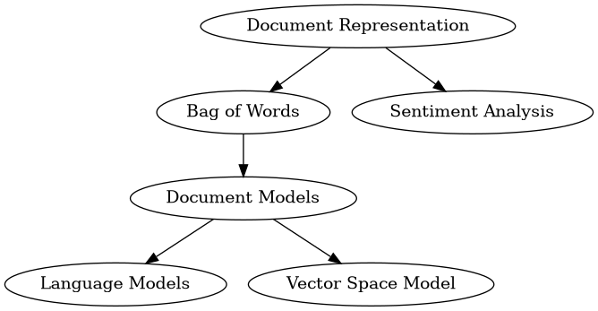

# Text Mining 1
> wk 4 Material


We are going to use `rtweet` not `tweetR` because it is newer, maintained, built on a newer base **_R_** and gets more data.

In order to use it refer to [This Exemplar](../../../DataSci/Social_Web_Analytics/04_TM_Indexing_Querying.rmd) and [get the Tokens from here](file:///home/ryan/Dropbox/Studies/2020Autumn/Social_Web_Analytics/Practicals/Twitter_Tokens.org)

Basically the rest is fairly self explanatory, to do the analysis do something like this:

```r
tk <- rtweet::create_token(
  app = "SWA",
  consumer_key = "dE7HNKhwHxMdB...",
  consumer_secret = "7ByyC6lR9d...",
  access_token = "124082117801438...",
  access_secret = "HLBWzHcemHzYJnw5Z...",
  set_renv = FALSE)

```

## Search for Tweets
```r
## Search for Tweets
tweets_rt <- rtweet::search_tweets(q = 'Kevin Bacon', n = 10^2, type = "recent", include_rts = FALSE, token = tk)
head(tweets_rt)
```

## Create a Corpus
```r
## Create a Corpus
tweet_source <- tm::VectorSource(tweets_rt$text)
tweet_corpus <- tm::Corpus(x = tweet_source)

## Format as UTF8
make_UTF <- function(x) {
  iconv(x, to = "UTF-8")
}
tweet_corpus <- tm_map(x = tweet_corpus, FUN = make_UTF)
```

## Clean the corpus
You may also want to use the `qdap` package as demonstrated [here](DataCamp/01.Introduction_Bag_of_Words.md)

```r
## Clean the Corpus
clean_corp <- function(corpus) {
  tm_map(corpus, FUN = removeNumbers)
  tm_map(corpus, FUN = removePunctuation)
  tm_map(corpus, FUN = stripWhitespace)
  tm_map(corpus, FUN = removeWords, stopwords())
      ## stopwords() returns characters and is fead as second argument
  tm_map(corpus, FUN = stemDocument)
}
tweet_corpus <- clean_corp(tweet_corpus)
```

## Plot the Wordcloud

```r
library(wordcloud)
wordclout(tweet_corpus)
```

## Find TD-IDF Weights
First create a Document-Term Matrix (Document-Term in order of Row-Column):

```r
## Make a Document Term Matrix
                         ### RowColumnMatrix
tweet_matrix   <- as.matrix(DocumentTermMatrix(tweet_corpus))
colnames(tweet_matrix)[1:10]
```
### Solve the TF and IDF

* Inter Document Frequency
    + $\text{IDF}=\ln(\frac{N}{f_t})$
* Term Frequency
    + $\text{TF}=\ln(f_{d,t}+1)$

* TF-IDF
  + $w_{d, t} = \ln\left(f_{d,t} + 1 \right)\times \ln\left( \frac{N}{f_t} \right)$

In order to get each term use matrix multiplication and diagonalisation:

$$\begin{aligned}
\begin{bmatrix}
    a & b & c \\
    d & e & f \\
    g & h & i \\
\end{bmatrix}  \times
\begin{bmatrix} x & 0 & 0 \\ 0 & y & 0 \\ 0 & 0 & z \end{bmatrix} &=
\begin{bmatrix}
    a(x) & b(y) & c(z) \\
    d(x) & e(y) & f(z) \\
    g(x) & h(y) & i(z) \\
\end{bmatrix}  \\
&=
\begin{bmatrix}
    a & b & c \\
    d & e & f \\
    g & h & i \\
\end{bmatrix}  \times
\mathrm{diag} \left( \begin{bmatrix} x \\ y \\ z \end{bmatrix}  \right)
\end{aligned}$$


```r
## Use Term-Frequency and Inter-Document Frequency
N <- nrow(tweet_matrix)   # Number of Documents
ft <- apply(tweet_matrix, 2, sum)

TF <- log(tweet_matrix + 1)
IDF <- log(N/ft)

    # Because each term in TF needs to be multiplied through
    # each column of IDF there would be two ways to do it,
      # a for loop which will be really slow
      # Diagonalise the matrix then use Matrix multiplication

tweet_weighted           <- TF %*% diag(IDF)
colnames(tweet_weighted) <- colnames(tweet_matrix)

                         ### RowColumnMatrix
```

## Plot Using Weights

Finally a plot can be made using the `wordcloud` package:

```r
## Only consider the first 30 words
(relevant <- sort(apply(tweet_weighted, 2, mean), decreasing = TRUE)[1:30]) %>% head()
wordcloud(
    words = names(relevant),
    freq = relevant,
    min.freq = 0, colors = 7:(7*6)/3,
    random.color = FALSE)
```

## All together

```r
## Search for Tweets
tweets_rt <- rtweet::search_tweets(q = 'Kevin Bacon', n = 10^2, type = "recent", include_rts = FALSE, token = tk)
head(tweets_rt)

## Create a Corpus
tweet_source <- tm::VectorSource(tweets_rt$text)
tweet_corpus <- tm::Corpus(x = tweet_source)

## Format as UTF8
make_UTF <- function(x) {
  iconv(x, to = "UTF-8")
}
tweet_corpus <- tm_map(x = tweet_corpus, FUN = make_UTF)

## Clean the Corpus
clean_corp <- function(corpus) {
  tm_map(corpus, FUN = removeNumbers)
  tm_map(corpus, FUN = removePunctuation)
  tm_map(corpus, FUN = stripWhitespace)
  tm_map(corpus, FUN = removeWords, stopwords())
      ## stopwords() returns characters and is fead as second argument
  tm_map(corpus, FUN = stemDocument)
}
tweet_corpus <- clean_corp(tweet_corpus)

## Make a Document Term Matrix
                         ### RowColumnMatrix
tweet_matrix   <- as.matrix(DocumentTermMatrix(tweet_corpus))
colnames(tweet_matrix)[1:10]

## Use Term-Frequency and Inter-Document Frequency
N <- nrow(tweet_matrix)   # Number of Documents
ft <- apply(tweet_matrix, 2, sum)

TF <- log(tweet_matrix + 1)
IDF <- log(N/ft)

    # Because each term in TF needs to be multiplied through
    # each column of IDF there would be two ways to do it,
      # a for loop which will be really slow
      # Diagonalise the matrix then use Matrix multiplication

tweet_weighted           <- TF %*% diag(IDF)
colnames(tweet_weighted) <- colnames(tweet_matrix)

                         ### RowColumnMatrix

## Only consider the first 30 words
(relevant <- sort(apply(tweet_weighted, 2, mean), decreasing = TRUE)[1:30]) %>% head()

## Make plot
wordcloud(tweet_corpus)
```

## Weighting the terms

A trivial method to use the vector space model is to:
* treat each document like a vector
  + where the frequency of a words occurence measurements the value of the vector given that value.




### Weighting the Document Matrix

A method to analyse word similarity is to treat each document as a vector with a
number of dimensions corresponding to the number of unique terms. A simple way
is to use the frequency of the word as the weight (as in the value for the
corresponding dimension for that vector), this however has two issues:

1. Repeating words shouldn't be linearly related to a similarity score, it
   should taper off
2. Common words dominate the results.

A way around this is to use:

* Inverse Document Frequency
  + This is the number of documents per term occurrence, then log scaled.
    + $\text{IDF}=\ln(\frac{N}{f_t})$
* Term Frequency
  + This is the frequency of the term within a document, log scaled (the +1
    offset is because $\ln(0) \uparrow \quad \wedge \quad \ln(1)\downarrow$
    + $\text{TF}=\ln(f_{d,t}+1)$

These can be combined to give a form of TF-IDF weighting:

$$\begin{aligned}
    w_{d, t} = \ln\left(f_{d,t} + 1 \right)\times \ln\left( \frac{N}{f_t} \right)
\end{aligned}$$

In order to apply this type of weighting we will need a `DocumentTermMatrix`:

```{r, warning = FALSE}
                         ### RowColumnMatrix
tweet_matrix   <- as.matrix(DocumentTermMatrix(tweet_corpus))
colnames(tweet_matrix)[1:10]

N <- nrow(tweet_matrix)   # Number of Documents
ft <- apply(tweet_matrix, 2, sum)

TF <- log(tweet_matrix + 1)
IDF <- log(N/ft)

# Because each term in TF needs to be multiplied through
# each column of IDF there would be two ways to do it,
  # a for loop which will be really slow
  # Diagonalise the matrix then use Matrix multiplication

tweet_weighted           <- TF %*% diag(IDF)
colnames(tweet_weighted) <- colnames(tweet_matrix)
tweet_weighted[1:4, 1:4]
tweet_matrix[1:4, 1:4]
```
