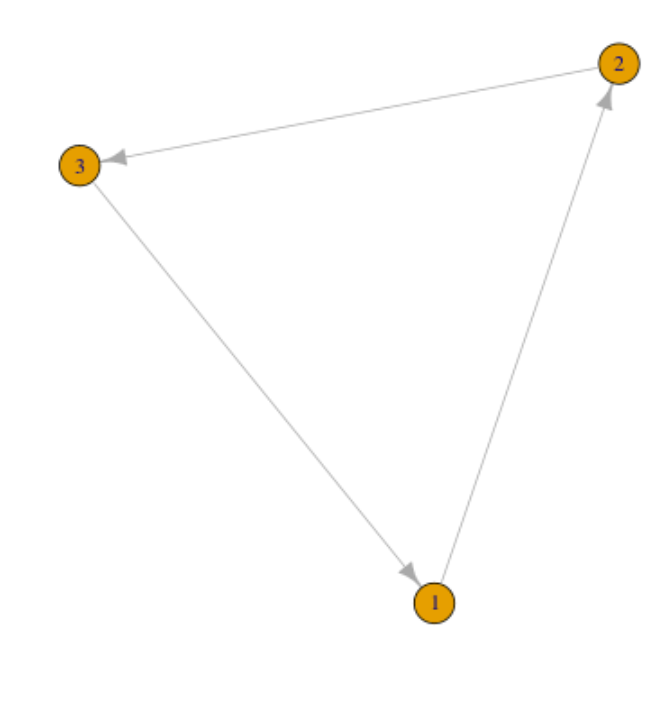

# Adjacency-Matrices
## Interpreting an Adjacency Matrix
Take a row name, look across the matrix left-to-right, marked cells indicate nodes to which travel is permitted.

* rows are observed nodes in the graph
* colums are features of the graph, i.e. possitble destinations from an observation

## Writing

* Write the nodes vertically down a table
* Mark accross the rows, left-to-right, indicating to which destination travel is permitted.

## Example
```R
library(igraph)
gd1 = graph.formula(1-+2, 2-+3, 3-+1)
plot(gd1)
get.adjacency(gd1)
```


|     |  1  |  2  |  3  |
| --- | --- | --- | --- |
| 1   | 0   | 1   | 0   |
| 2   | 0   | 0   | 1   |
| 3   | 1   | 0   | 0   |
