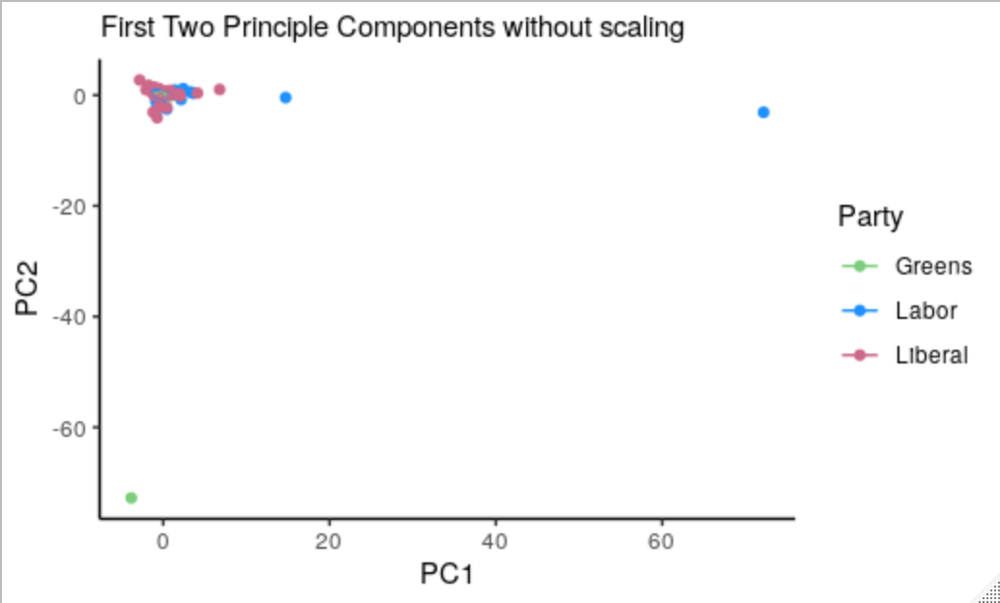
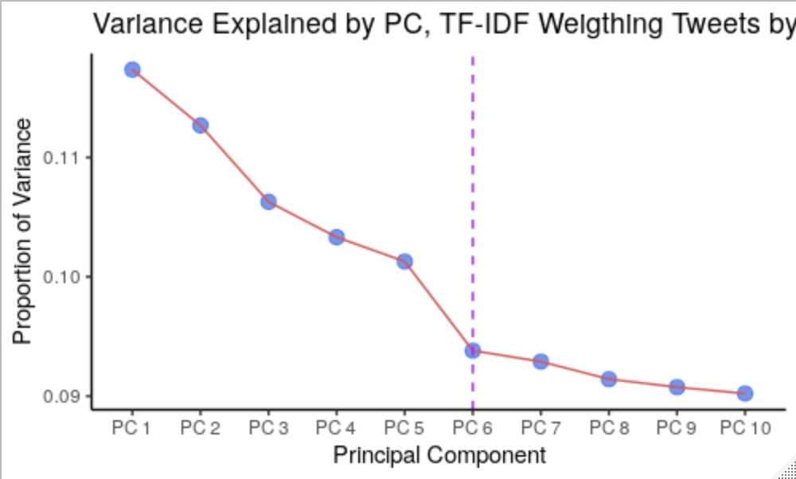
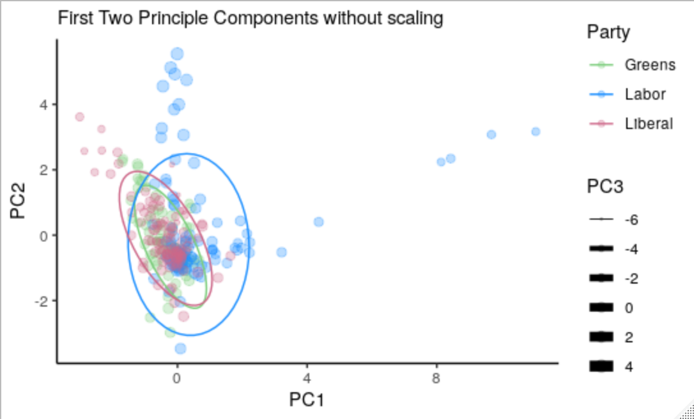
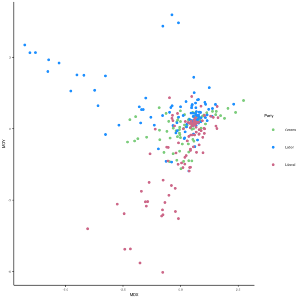
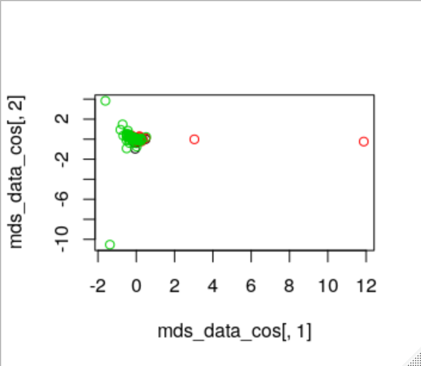

# Visualisation and MDS
## Load Packages
First Load all the packages:

```r
# Load Packages ----------------------------------------------------

  if(require("pacman")){
    library(pacman)
  }else{
    install.packages("pacman")
    library(pacman)
  }
    pacman::p_load(xts, sp, gstat, ggplot2, rmarkdown, reshape2, ggmap,
                 parallel, dplyr, plotly, tidyverse, reticulate, UsingR, Rmpfr,
                 swirl, corrplot, gridExtra, mise, latex2exp, tree, rpart, lattice,
                 coin, primes, epitools, maps, clipr, ggmap, twitteR, ROAuth,
                 tm, rtweet, base64enc, httpuv, SnowballC, RColorBrewer, wordcloud, ggwordcloud)
mise()
```

The tokens are located in `KeePass`:

```r
# Set up Tokens ===================================================

     options(RCurlOptions = list(verbose = FALSE, capath = system.file("CurlSSL", "cacert.pem", package = "RCurl"), ssl.verifypeer = FALSE))
   
   setup_twitter_oauth(
     consumer_key = "dE7...",
     consumer_secret = "7B...",
     access_token = "1240821...",
     access_secret = "HLBWzHce...")

# rtweet ============================================================
tk <-    rtweet::create_token(
     app = "SWA",
     consumer_key    = "dE7H...",
     consumer_secret = "7By...",
     access_token    = "1240...",
     access_secret   = "HLBWzH...",
     set_renv        = FALSE)
```

## Get Tweets
In order to practice visualisation using PCA, it may be helpful to have data that appears to cluster, so political tweets would be ideal, we can use the handles for the party leaders:

```r
# Political Tweets ---------------------------------------------------
   n <- 100

   # twitteR::userTimeline("billshortemp", n = n)
altw <- rtweet::get_timeline("AlboMP",   n = n, token = tk)
smtw <- rtweet::get_timeline("ScottMorrisonMP",       n = n, token = tk)
abtw <- rtweet::get_timeline("AdamBandt", n = n, token = tk)
```

### Create a Corpus
The `tm` package requires tweets to be stored in a `corpus` object, there are three steps to creating this:
1. Extract the Text
2. use `tm::VectorSource(text)` to create a `tm` source file.
3. use `tm::VCorpus()` to create a *Volatile Corpus*
    1. Volatile meaning stored in memory.

```r
# Create a Corpus ==============================================================
tweets <- c(altw$text, smtw$text, abtw$text)    # Get all the text
tweet_source <- tm::VectorSource(tweets)        # Create the 
tweet_corpus <- tm::VCorpus(x = tweet_source)
tweet_corpus[[1]]$content
strwrap(tweet_corpus[[1]])
```


### Clean the Corpus
This is the same method as shown [in Prac 04](04_TM_Index_Querying_TF-IDF.md) I've simply copied the function over, in [*DataCamp* Work](DataCamp/01.Introduction_Bag_of_Words.md) the `qdap` package was used as well.

```r
# Create a WordCloud #########################################################

## Clean the Corpus
clean_corp <- function(corpus) {
  corpus <- tm_map(corpus, FUN = removeNumbers)
  corpus <- tm_map(corpus, FUN = removePunctuation)
  corpus <- tm_map(corpus, FUN = stripWhitespace)
  corpus <- tm_map(corpus, FUN = removeWords, stopwords()) 
      ## stopwords() returns characters and is fead as second argument
  corpus <- tm_map(corpus, FUN = stemDocument)
}
tweet_corpus <- clean_corp(tweet_corpus)

wordcloud(tweet_corpus)
```

### Use TF-IDF Weighting
Now apply `TF-IDF` weighting from [before](04_TM_Index_Querying_TF-IDF.md):

```r
# Create a WordCloud Using TF-IDF Weighting ################################

## Create a DTM
tweet_matrix <- as.matrix(DocumentTermMatrix(tweet_corpus))
colnames(tweet_matrix)[1:3]

## Use Term-Frequency and Inter-Document Frequency
N <- nrow(tweet_matrix)   # Number of Documents
ft <- apply(tweet_matrix, 2, sum)

TF <- log(tweet_matrix + 1)
IDF <- log(N/ft)

# Because each term in TF needs to be multiplied through
# each column of IDF there would be two ways to do it, 
# a for loop which will be really slow
# Diagonalise the matrix then use Matrix multiplication

tweet_weighted           <- TF %*% diag(IDF)
colnames(tweet_weighted) <- colnames(tweet_matrix)
```

### Plot and Post the Words
```r
## Filter Relevant words
relevant <- sort(apply(tweet_weighted, 2, mean), decreasing = TRUE)[1:30]

## Make a wordcloud
p <- brewer.pal(n = 5, name = "Set3")
wordcloud(words = names(relevant),
          freq = relevant,
          colors = p, random.color = FALSE)
# Posting Tweets using R =======================================================
tw1 <- rtweet::post_tweet(status = "My first tweet from R, #WSU300958", token = tk)
tw2 <- rtweet::post_tweet(status = "Political Wordcloud Using TF-IDF #WSU300958", media = "~/Pictures/WordCloud.png", token = tk)
``` 

## Use PCA to Visualise the Tweets
The next step is using [PCA](../../Programming/R/IntroDataSci/PCA-PrincipalComponentAnalysis_10_IntroDataSci.md) to visualise the higher dimensional data.


:warning: Scaling bug :warning:


If you scale the data first, whether by using `scale = TRUE`, using `scale()` or
by simply doing $\mathtt{myscale}(x) = \frac{\bar{x}-x}{s}$ the PCA plot will
come out with large outliers, like this:




PCA operates by taking a matrix of values, whereby rows are observations and
columns are features, this means we need rows as Documents and Columns as
features in order to perform PCA, this would a be a DocumentTermMatrix[^1].

Geometrically a plot of the first two *Principal Components* ($Z_1, Z_2$) is a
projection of data onto the subspace spanned by the first two loading vectors
($\phi_1, \phi_2$)

To perform the PCA use the `prcomp` function:

```r
pol.pca <- prcomp(tweet_weighted, scale = FALSE)
```

This returns a `prcomp` object that is essentially a list with 

* a `rotation` matrix 
  + (which is a matrix of the loading vectors)
* a matrix of the co-ordinates in the Principle Compenent frame of reference 
  + denoted by `x`
* `sdev`; The standard deviation attributable to each principle component.
* `centre` which is a logical indicating whether centring was used
  + If centring was used it will be a vector of the `centre` values
* `scale` which is a logical indicating whether scaling was used
  + If scaling was used it will be a vector of the `scale` values
  

### Bi Plot 
a [Biplot](https://en.wikipedia.org/wiki/Biplot) is a  plot of the first two principle components and the
corresponding loading vectors. Roughly speaking, the loading vectors help show
the explanation each variable contributes to a principle component.[^2] 


  
    
      #biplot 

      
      


A biplot can be produced by simply using the `biplot` function:

```r
biplot(pol.pca, cex = 0.5)
```
> See also [the ggbiplot package](https://github.com/vqv/ggbiplot)

  

### Scree Plot
A scree plot is a plot of the variance explained by each principle component,
Ideally we would find a vertex where we could cut it off and say that the data
can be explained by said principle components, for large data sets like this it
isn't the case however.

To create a scree plot basically just plot the `sdev` in as a line or barchart,
just be mindful to encode the names of the *Principal Components* as ordered factors
because otherwise the order may not be preserved:

```r
pcaVar <- pol.pca$sdev ^ 2
pcaVar <- pcaVar[1:10]
pcaVarpr <- pcaVar / sum(pcaVar)
pcaVarpr <- enframe(pcaVarpr)

names(pcaVarpr) <- c("Principal.Component", "Proportion.Variance")
                        ## This throws a warning
for (i in 1:nrow(pcaVarpr)) {
  pcaVarpr[["Principal.Component"]][i] <- paste("PC", i)
}

pcaVarpr$Principal.Component <-
  factor(
    pcaVarpr$Principal.Component,
    ordered = TRUE,
    levels = pcaVarpr$Principal.Component
  )

ggplot(data = pcaVarpr,
       aes(x = Principal.Component,
           y = Proportion.Variance,
           group = 1)) +
  geom_point(size = 3, alpha = 0.7, col = "RoyalBlue")  +
  geom_line(col = "IndianRed") +
  labs(x = "Principal Component",
       y = "Proportion of Variance",
       title = "Variance Explained by PC, TF-IDF Weigthing Tweets by Party Leaders") +
  theme_classic() +
  geom_vline(xintercept = 4,
             col = "purple",
             lty = 2)
```



### Plot the First two PCA's
In order to plot the first two PC's, create a data frame:

```r
pca_data$Party  <-
  factor(c(rep("Greens", n), rep("Labor", n), rep("Liberal", n)))
pol.km <-
  kmeans(tweet_weighted, centers = 3, nstart = 200) %>%  as.vector()
pca_data$kmeans <- as.factor(pol.km$cluster)
head(pca_data)
```

Then it's just a matter of calling ggplot:

```r
ggplot(data = pca_data,
       aes(x = PC1, y = PC2, size = PC3, col = Party)) +
  geom_point(alpha = 0.3) +
  ##  geom_point(aes(shape = kmeans)) +
  theme_classic() +
  ## Colours are applied in order of appearance of the factor
  ## Introduce factors alphabetically where possible
  scale_color_manual(values = c("Palegreen3", "DodgerBlue", "Palevioletred3")) +
  scale_size(range = c(0.1, 3)) +
  labs(main = "Tweets by Part Leaders using TF-IDF Weighting",
       subtitle = "First Two Principle Components without scaling") +
  stat_ellipse() ## +
  ## Scaling Fix
  ##  scale_x_continuous(limits = c(-quantile(pca_data$PC1, c(0.99)), quantile(pca_data$PC1, c(0.99)))) +
  ##  scale_y_continuous(limits = c(-quantile(pca_data$PC2, c(0.99)), quantile(pca_data$PC2, c(0.99))))
  
```

in this example I encoded the third principle component as the size of the
points:




## Use Multi-Dimensional Scaling to Visualise the tweets
The whole idea of Multi-Dimensional Scaling is to 
### Using the `dist` function in **_R_**
The `dist` function takes each row as a vector and each column as a variable (i.e. axis) of that vector, it then compares every point and produces a table summarising every combination of possible differences, so for example the matrix:

$$\begin{aligned}
  \begin{bmatrix}
    0 & 0 & 5 \\
    0 & 4 & 0 \\
    3 & 0 & 0
  \end{bmatrix} 
\end{aligned}$$

that matrix in **_R_** would really represent the three vectors $\vec{v_1} =  \left<0, 0, 3 \right>, \vec{v_2} = \left<0, 4, 0 \right>, \vec{v_3} = \left<5, 0, 0 \right>$ and so there would be three possible distances we could be possibly be interested in:

* $\left|     \left| \vec{v_1} - \vec{v_2} \right|  \right| = \left|     \left| \vec{v_1} - \vec{v_2} \right|  \right|= \mathrm{d}\left( \vec{v_1}, \vec{v_2} \right) = \mathrm{d}\left( \vec{v_2}, \vec{v_1} \right)$
* $\left|     \left| \vec{v_1} - \vec{v_3} \right|  \right| = \left|     \left| \vec{v_3} - \vec{v_1} \right|  \right| = \mathrm{d}\left( \vec{v_1}, \vec{v_3} \right) = \mathrm{d}\left( \vec{v_3}, \vec{v_1} \right)$
* $\left|     \left| \vec{v_2} - \vec{v_3} \right|  \right| = \left|     \left| \vec{v_3} - \vec{v_2} \right|  \right| = \mathrm{d}\left( \vec{v_2}, \vec{v_3} \right) = \mathrm{d}\left( \vec{v_2}, \vec{v_3} \right)$

**_R_** will return this as a table (well a `matrix` class) like this:

|          | Vector 1                      | Vector 2                      | Vector 3 |
|----------|-------------------------------|-------------------------------|----------|
| Vector 1 | 0                             | Repeated                      | Repeated |
| Vector 2 | $\mathrm{d}\left(1, 2\right)$ | 0                             | Repeated |
| Vector 3 | $\mathrm{d}\left(1, 2\right)$ | $\mathrm{d}\left(1, 2\right)$ | 0        |
|          |                               |                               |          |


> `help(diff)`;
> This function computes and returns the distance matrix computed by using the
> specified distance measure to compute the distances between the rows of a data
> matrix.

So if we did this all in **_R_** with some arbitrary numbers:

```r
(rbind(c("x" = 0, "y" = 0, "z" = 4),
      c("x" = 1, "y" = 1, "z" = 1),
      c("x" = 0, "y" = 3, "z" = 0))) %>% dist()
```
```r
     x y z
[1,] 0 0 4
[2,] 1 1 1
[3,] 0 3 0
> 
         1        2
2 3.316625         
3 5.000000 2.449490
```
Then we could use this distances to visualise these vectors by plotting them in such a way that preserves the distances, in order to do that the `cmdscale` can be used:

> `help(cmdscale)`; Multidimensional scaling takes a set of dissimilarities and
> returns a set of points such that the distances between the points are
> approximately equal to the dissimilarities. (It is a major part of what
> ecologists call ‘ordination’.)
>
> A set of Euclidean distances on n points can be represented exactly in at
> most $n - 1$ dimensions. `cmdscale` follows the analysis of [Mardia (1978)](https://www.tandfonline.com/doi/abs/10.1080/03610927808827707),
> and returns the best-fitting $k$-dimensional representation, where $k$ may be
> less than the argument `k`. []()
>
> ... The configuration returned is given in principal-component axes...

### Finding the Distance Matrix of Tweets
In order to find the distance matrix of the tweets first be mindful that the
matrix must have rows as observations and columns as features, then it's just a matter of calling `dist` over the matrix, in order to producs the *Classical Multidimensional Scaling* representation, simply pass this distance matrix to the `cmdscale` function and it will do all the work:

```r
tweet_matrix[1:3, 1:3]
tweet_dist <- dist(tweet_weighted)
tweet_mds  <- cmdscale(d = tweet_dist, k = 2)
tweet_mds.df <- as.data.frame(tweet_mds)
names(tweet_mds.df) <- c("MDX", "MDY")
head(tweet_mds.df)

## Add Colours
tweet_mds.df$Party <- factor(c(rep("Greens", n), rep("Labor", n), rep("Liberal", n)))
```
which will produce a data frame like this:

```
     MDX    MDY Party 
       
1 -0.427  0.211 Greens
2 -0.447  0.294 Greens
3 -0.240 -0.320 Greens
4 -0.541  0.249 Greens
5 -0.302  0.374 Greens
6 -0.388 -0.278 Greens
```

Then it's simply a matter of plotting it which is easy enough:

```r
(ggmds <- ggplot(mds_data, aes(x = MDX, y = MDY, col = Party)) +
  geom_point() +
  scale_color_manual(values = c("Palegreen3", "DodgerBlue", "Palevioletred3")) +
  theme_classic())
```



### Binary Distance
In much the same way binary distance could be plotted by specifying that particular method (without the niceties of `ggplot`):

```r
# Binary Distance ==============================================================
## Remember to use the weigted values though,
## The weighted values are a good adjustment and is consistent with different
## measures of distance
dist_mat_bin <- dist(tweet_matrix, method = "binary")
mds_data_bin <- cmdscale(dist_mat_bin, k = 2)
plot(mds_data_bin[,1], mds_data_bin[,2], col = c("ForestGreen", "PowderBlue", "MediumVioletRed")[pca_data$Party])
```


### Cosine Distance
#### Finding Unit Vectors
Recall that taking the matrix multiplication of a diagonal matrix is equivalent to multipling each term of a matrix by a value, for example:

$$
\left(
\begin{array}{ccc}
 a_{1,1} & a_{1,2} & a_{1,3} \\
 a_{2,1} & a_{2,2} & a_{2,3} \\
 a_{3,1} & a_{3,2} & a_{3,3} \\
\end{array}
\right) \cdot
\left(
\begin{array}{ccc}
 b_1 & 0 & 0 \\
 0 & b_2 & 0 \\
 0 & 0 & b_3 \\
\end{array}
\right) =
\left(
\begin{array}{ccc}
 b_1 a_{1,1} & b_2 a_{1,2} & b_3 a_{1,3} \\
 b_1 a_{2,1} & b_2 a_{2,2} & b_3 a_{2,3} \\
 b_1 a_{3,1} & b_2 a_{3,2} & b_3 a_{3,3} \\
\end{array}
\right)
$$

Play around this in *Wolfram Mathematica*:

```mathematica
Aeg = Array[Subscript[a, #1, #2] &, {3, 3}];
Aeg // MatrixForm
Beg = {Subscript[b, 1], Subscript[b, 2], Subscript[b, 3]} // 
  DiagonalMatrix
(Aeg.Beg) // MatrixForm
```

So in order to create a vector of unit vectors it is sufficient to merely
perform:

```r
U   <- tweet_matrix %*% diag(1/sqrt(colSums(tweet_matrix^2)))
U_w <- tweet_weighted %*% diag(1/sqrt(colSums(tweet_weighted^2)))
```
#### Vector Dot Product
::: alert-info
 > The Cosine Similarity is the dot product of the Unit vectors
 > > The Cosine Distance (1-Cos Sim), that way it's direction is correct.

:::

The dot product of two vectors is the area spanned by a rectangle of length equal to the first vector and width equal to the projection (i.e. the shadow) of the first vector onto the second.


The cosine similarity is the length of that projection, if the length of both vectors are independetly scaled to one, the dot product will be different
but the angle won't change, also the area of the dot product will be $1 \times$ the projection:


$$\begin{aligned}
    \left| \left| \mathbf{X} \right| \right| = \left|  \left| \mathbf{Y} \right| \right|  &\implies   \frac{\mathbf{\mathbf{X}\cdot  \mathbf{Y}}}{\left| \left| \mathbf{X} \right| \right|\times \left| \left| \mathbf{Y} \right| \right|}\\
    &= \mathbf{X}\cdot  \mathbf{Y} \\
    &= \cos\left( \mathbf{X}, \mathbf{Y} \right)\\
    &= \sum^{n}_{i= 1}   \left[ x_i y_i \right] 
\end{aligned}$$

Hence the [Euclidean Distance](https://en.wikipedia.org/wiki/Euclidean_distance)
will be:


$$\begin{aligned}
\mathrm{dist}\left( \mathbf{X}, \mathbf{Y} \right)= \left| \left| \mathbf{X}-\mathbf{Y} \right| \right| \\
&= \sqrt{\sum^{n}_{i= 1}   \left[ \left( x_i-y_i \right)^2 \right] } \\
\mathrm{dist}\left( \mathbf{X}, \mathbf{Y} \right)^2&= \sum^{n}_{i= 1}  \left[ \left( x_i-y_i \right)^2 \right] \\
&= \sum^{n}_{i= 1}   \left( x^2 \right)+  \sum^{n}_{i= 1}   \left( y_i^2 \right)+ 2 \sum^{n}_{i= 1}   \left( x_iy_i \right) \\
&= 1+ 1 +  2 \times  \frac{\sum^{n}_{i= 1}   \left( x_iy_i \right)}{\left( 1 \right) }\\
&= 2+ 2\times \frac{\sum^{n}_{i= 1}   \left( x_iy_i \right)}{\left| \left| \mathbf{X} \right| \right|\times \left| \left| \mathbf{Y} \right| \right|}\\
&= 2+ 2 \cos\left( \mathbf{X}, \mathbf{Y} \right)\\
\ \\
& \implies  \left( 1- \cos\left( \mathbf{X}, \mathbf{Y} \right) \right) = \frac{\mathrm{dist}\left( \mathbf{X}, \mathbf{Y} \right)}{2}
\end{aligned}$$

The only thinig to note is that the cosine similarity is 1 when two
vectors are identical in direction but is 0 when they are totally different in
direction (i.e. perpendicular or rather orthogonal).
For a metric of distance we want it the other way around so we just subtract it
from 1.

So in order to determine the cosine distance, it is sufficient to perform the following:
```r
 # Cosine Distance===============================================================
# Create Unit Vectors ##########################################################
## Recall matrix multiplication of a diagonalised matrix is product of elements
U   <- tweet_matrix %*% diag(1/sqrt(colSums(tweet_matrix^2)))
U_w <- tweet_weighted %*% diag(1/sqrt(colSums(tweet_weighted^2)))
# Create Distance Matrix #######################################################
# Plot the MDS #################################################################
## Make the Distance Matrix
dist_mat_cos <-dist(U_w, method = "euclidean")^2/2
## Make the MDS
mds_data_cos <- cmdscale(dist_mat_cos, k = 2)
names(mds_data_cos) <- c("xvals", "yvals")
plot(mds_data_cos[,1], mds_data_cos[,2], col = pca_data$Party) 
``` 

which will produce something like this:




