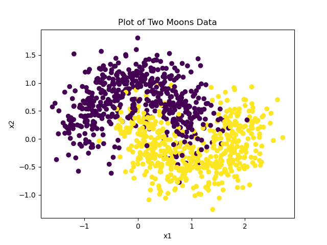

# Classifying Moons Data using Torch

[this is a new
page](http://localhost:9999/doku.php?id=university:summer_research_2020:this_is_a_new_page "university:summer_research_2020:this_is_a_new_page"){.wikilink1}

This code will build a Neural Network using torch tensors, autograd and
functions defined from scratch to Moons data that it generates.



:::

## By Defining a Function

```python
#-- Import Packages -------------------------------------------
import numpy as np
import sklearn
from sklearn.model_selection import train_test_split
from sklearn import datasets
from sklearn import tree
import matplotlib.pyplot as plt

#-- Generate Two Moons Data -----------------------------------
X, y = datasets.make_moons(n_samples = 1000, noise = 0.3, random_state = 0)
y = np.reshape(y, (len(y), 1)) # Make y vertical n x 1 matrix.

# Plot the Generated Data -----------------------------------
    # Make an empty figure
plt.ion()
p = plt.figure()
    # Create the Scatter Plot
plt.scatter(X[:,0], X[:, 1], c = y)
    # Labels
plt.xlabel("x1")
plt.ylabel("x2")
plt.title("Plot of Two Moons Data")
    # Show the Plot
plt.show()

#-- Split data into Training and Test Sets --------------------
X_train, X_test, y_train, y_test = train_test_split(X, y, test_size = 0.4)

#-Model the Data Using Trees---------------------------------
#  Define a Decision Tree Classifier -------------------------
d = 4
clf = sklearn.tree.DecisionTreeClassifier(max_depth = d)

#. Train the Model ..........................................
clf.fit(X_train, y_train)

#. Test the Model
score = clf.score(X_test, y_test) # mean accuracy (TP+TN)/(P+N)
misclassification_rate_tree = np.average(clf.predict(X) == y)

print("The performance is:\n" + str(score*100) + "%")
print("The misclassification rate is:\n", misclassification_rate_tree)

# Fit the Neural Network ------------------------------------
## Import the Packages
import numpy as np
import pandas as pd
import torch
import torch.nn as nn
import torch.nn.functional as F
## Create Tensors
X = torch.from_numpy(X.astype(np.float32))
y = torch.from_numpy(y.astype(np.float32))
## Define a Model as a class
input_size = 2
hidden_size = 3 # This is arbitrary
output_size = 1 # should be 1, just like y

class NeuralNetwork():
    def __init__(self, input_size, hidden_size, output_size):

        # Initialize Random Weights
        self.W1 = torch.randn(input_size, hidden_size, requires_grad=True)
        self.W2 = torch.randn(hidden_size, hidden_size, requires_grad=True)
        self.W3 = torch.randn(hidden_size, output_size, requires_grad=True)

        # Add Bias Values
        self.b1 = torch.randn(hidden_size, requires_grad = True)
        self.b2 = torch.randn(hidden_size, requires_grad = True)
        self.b3 = torch.randn(output_size, requires_grad = True)

    # Define the Forward Pass
    def forward(self, inputs):
        z1 = inputs.mm(self.W1).add(self.b1)
        a1 = 1 / (1 + torch.exp(-z1))
        z2 = a1.mm(self.W2).add(self.b2)
        a2 = 1/(1+torch.exp(-z2))
        z3 = a2.mm(self.W3).add(self.b3)
        output = 1/(1+torch.exp(-z3))
        return output


model = NeuralNetwork(input_size, hidden_size, output_size)
input_size = 2 
hidden_size = 3 # randomly chosen
output_size = 1 # we want it to return a number that can be used to calculate the difference from the actual numberclass NeuralNetwork():

epochs = 10000
learning_rate = 0.005
model = NeuralNetwork(input_size, hidden_size, output_size)
inputs = torch.tensor(X, dtype=torch.float)
labels = torch.tensor(y, dtype=torch.float)#store all the loss values
losses = []


for epoch in range(epochs):
    # Forward Pass (Calculate y_pred)
    output = model.forward(inputs)

    # Binary Cross Entropy Formula
    loss = -((labels * torch.log(output)) + (1 - labels) * torch.log(1 - output)).sum()

    # Log the log so it can be plotted after the fact
    losses.append(loss.item())

    # Calculate the gradients of the weights wrt to loss
    loss.backward()
    print(loss.item())

    # Adjust the weights based on the previous calculated gradients
    model.W1.data -= learning_rate * model.W1.grad
    model.W2.data -= learning_rate * model.W2.grad
    model.W3.data -= learning_rate * model.W3.grad
    model.b1.data -= learning_rate * model.b1.grad
    model.b2.data -= learning_rate * model.b2.grad
    model.b3.data -= learning_rate * model.b3.grad

    # Zero the Gradients so they aren't readjusted
    model.W1.grad.zero_()
    model.W2.grad.zero_()
    model.W3.grad.zero_()
    model.b1.grad.zero_()
    model.b2.grad.zero_()
    model.b3.grad.zero_()

# print("Final loss: ", losses[-1])
plt.plot(losses)
plt.show()

# Measure the Misclassification Rate ------------------------
yhat = model.forward(X).detach().numpy().reshape((1, -1))
yhat = [i>0.5 for i in yhat ]
yhat = np.array(yhat).astype(int)
y = y.detach().numpy().reshape(1, -1).astype(int)

import tools
misclassification_rate_nn = tools.misclassification_rate(yhat, y)
misclassification_rate_tree = tools.misclassification_rate(clf.predict(X), y)

# misclassification_rate_nn = np.average(yhat == y.reshape(1, -1))
# [i == j for i in yhat for j in y.reshape(1, -1)]

print("The misclassification rate tree is:\n", misclassification_rate_tree)
print("The misclassification rate network is:\n", misclassification_rate_nn)
```

:::

### Measuring the Testing Error {#measuring_the_testing_error .sectionedit3}

::: {.level3}

```python
#-- Import Packages -------------------------------------------
import numpy as np
import sklearn
from sklearn.model_selection import train_test_split
from sklearn import datasets
from sklearn import tree
import matplotlib.pyplot as plt
 
#-- Generate Two Moons Data -----------------------------------
X, y = datasets.make_moons(n_samples = 400, noise = 0.3, random_state = 3141, shuffle=True)
y = np.reshape(y, (len(y), 1)) # Make y vertical n x 1 matrix.
 
# Plot the Generated Data -----------------------------------
    # Make an empty figure
# plt.ion()
p = plt.figure()
    # Create the Scatter Plot
plt.scatter(X[:,0], X[:, 1], c = y)
    # Labels
plt.xlabel("x1")
plt.ylabel("x2")
plt.title("Plot of Two Moons Data")
    # Show the Plot
plt.show()
 
#-- Split data into Training and Test Sets --------------------
X_train, X_test, y_train, y_test = train_test_split(X, y, test_size = 0.4)
 
#-Model the Data Using Trees---------------------------------
#  Define a Decision Tree Classifier -------------------------
d = 4
clf = sklearn.tree.DecisionTreeClassifier(max_depth = d)
 
#. Train the Model ..........................................
clf.fit(X_train, y_train)
 
#. Test the Model
score = clf.score(X_test, y_test) # mean accuracy (TP+TN)/(P+N)
misclassification_rate_tree_train  = np.average(clf.predict(X_train) != y_train.reshape(1, -1)[0])
misclassification_rate_tree_test  = np.average(clf.predict(X_test) != y_test.reshape(1, -1)[0])
 
print("The performance is:\n" + str(score*100) + "%")
print("The misclassification rate is:\n", misclassification_rate_tree_test)
 
# Fit the Neural Network ------------------------------------
## Import the Packages
import numpy as np
import pandas as pd
import torch
import torch.nn as nn
import torch.nn.functional as F
## Create Tensors
X_train = torch.from_numpy(X_train.astype(np.float32))
y_train = torch.from_numpy(y_train.astype(np.float32))
X_test = torch.from_numpy(X_test.astype(np.float32))
y_test = torch.from_numpy(y_test.astype(np.float32))
## Define a Model as a class
input_size = 2
hidden_size = 3 # This is arbitrary
output_size = 1 # should be 1, just like y
 
class NeuralNetwork():
    def __init__(self, input_size, hidden_size, output_size):
 
        # Initialize Random Weights
        self.W1 = torch.randn(input_size, hidden_size, requires_grad=True)
        self.W2 = torch.randn(hidden_size, hidden_size, requires_grad=True)
        self.W3 = torch.randn(hidden_size, output_size, requires_grad=True)
 
        # Add Bias Values
        self.b1 = torch.randn(hidden_size, requires_grad = True)
        self.b2 = torch.randn(hidden_size, requires_grad = True)
        self.b3 = torch.randn(output_size, requires_grad = True)
 
    # Define the Forward Pass
    def forward(self, inputs):
        z1 = inputs.mm(self.W1).add(self.b1)
        a1 = 1 / (1 + torch.exp(-z1))
        z2 = a1.mm(self.W2).add(self.b2)
        a2 = 1/(1+torch.exp(-z2))
        z3 = a2.mm(self.W3).add(self.b3)
        output = 1/(1+torch.exp(-z3))
        return output
 
 
input_size = 2 
hidden_size = 3 # randomly chosen
output_size = 1 # we want it to return a number that can be used to calculate the difference from the actual numberclass NeuralNetwork():
 
epochs = 10000
learning_rate = 0.005
model = NeuralNetwork(input_size, hidden_size, output_size)
inputs = torch.tensor(X_train, dtype=torch.float)
labels = torch.tensor(y_train, dtype=torch.float)#store all the loss values
losses = []
 
 
for epoch in range(epochs):
    # Forward Pass (Calculate y_pred)
    output = model.forward(inputs)
 
    # Binary Cross Entropy Formula
    loss = -((labels * torch.log(output)) + (1 - labels) * torch.log(1 - output)).sum()
 
    # Log the log so it can be plotted after the fact
    losses.append(loss.item())
 
    # Calculate the gradients of the weights wrt to loss
    loss.backward()
    print(loss.item())
 
    # Adjust the weights based on the previous calculated gradients
    model.W1.data -= learning_rate * model.W1.grad
    model.W2.data -= learning_rate * model.W2.grad
    model.W3.data -= learning_rate * model.W3.grad
    model.b1.data -= learning_rate * model.b1.grad
    model.b2.data -= learning_rate * model.b2.grad
    model.b3.data -= learning_rate * model.b3.grad
 
    # Zero the Gradients so they aren't readjusted
    model.W1.grad.zero_()
    model.W2.grad.zero_()
    model.W3.grad.zero_()
    model.b1.grad.zero_()
    model.b2.grad.zero_()
    model.b3.grad.zero_()
 
# print("Final loss: ", losses[-1])
plt.plot(losses)
plt.show()
 
# Measure the Misclassification Rate ------------------------
def misclassification_rate(yhat, y):
#    yhat = model.forward(X)
#    yhat = yhat.detach().numpy().reshape(-1) > 0.5
#    y=np.array(y)
    return np.average(y != yhat)
 
print('-------------')
 
misclassification_rate_network_train = np.average((model.forward(X_train) > 0.5) != y_train)
misclassification_rate_network_test  = np.average((model.forward(X_test)  > 0.5) != y_test)
# misclassification_rate_tree_train = np.average((clf.predict(X_train.numpy()) > 0.05) != y_train.numpy())
# misclassification_rate_tree_test  = np.average((clf.predict(X_test.numpy()) > 0.5)  != y_test.numpy())
 
print(misclassification_rate_network_train)
 
print(np.average((model.forward(X_train) > 0.5) != y_train))
 
 
print('Misclassification Rates\n',
      '-------------------------\n',
      'Network \t Train \t',
      misclassification_rate_network_train, '\n',
      'Network \t Test \t',
      misclassification_rate_network_test,  '\n',
      'Tree    \t Train \t',
      misclassification_rate_tree_train, '\n',
      'Tree    \t Test \t',
      misclassification_rate_tree_test,  '\n',
    )
 
 
 
# import tools
# misclassification_rate_nn = tools.misclassification_rate(yhat, y)
# misclassification_rate_tree = tools.misclassification_rate(clf.predict(X_train), y)
#
#
# print("The misclassification rate for the tree based model is:\n", misclassification_rate_tree)
# print("The misclassification rate for the neural network model is:\n", misclassification_rate_nn)
```

:::

## By using the Sequential Module {#by_using_the_sequential_module .sectionedit4}

::: {.level2}

```python
#!/usr/bin/env python
 
# TODO Perhaps this approach actually worked and I was measuring the misclassification rate incorrectly?
# TODO Perhaps the Loss function is why this approach performed so poorly?
# TODO Implement testing and training data
  # TODO Implement a plot of both Testing and Training Data
# TODO Implement a method to intelligently exit the loop
 
#-- Import Packages -------------------------------------------
import numpy as np
import sklearn
from sklearn.model_selection import train_test_split
from sklearn import datasets
from sklearn import tree
import matplotlib.pyplot as plt
 
#-- Generate Two Moons Data -----------------------------------
X, y = datasets.make_moons(n_samples = 1000, noise = 0.3, random_state = 0)
y = np.reshape(y, (len(y), 1)) # Make y vertical n x 1 matrix.
 
# Plot the Generated Data -----------------------------------
    # Make an empty figure
plt.ion()
p = plt.figure()
    # Create the Scatter Plot
plt.scatter(X[:,0], X[:, 1], c = y)
    # Labels
plt.xlabel("x1")
plt.ylabel("x2")
plt.title("Plot of Two Moons Data")
    # Show the Plot
plt.show()
 
#-- Split data into Training and Test Sets --------------------
X_train, X_test, y_train, y_test = train_test_split(X, y, test_size = 0.4)
 
#-Model the Data Using Trees---------------------------------
#  Define a Decision Tree Classifier -------------------------
d = 4
clf = sklearn.tree.DecisionTreeClassifier(max_depth = d)
 
#. Train the Model ..........................................
clf.fit(X_train, y_train)
 
#. Test the Model
score = clf.score(X_test, y_test) # mean accuracy (TP+TN)/(P+N)
misclassification_rate_tree = np.average(clf.predict(X) == y)
 
print("The performance is:\n" + str(score*100) + "%")
print("The misclassification rate is:\n", misclassification_rate_tree)
 
# Fit the Neural Network ------------------------------------
## Import the Packages
import numpy as np
import pandas as pd
import torch
import torch.nn as nn
import torch.nn.functional as F
## Create Tensors
device = 'cpu'
dtype = float
X = torch.from_numpy(X.astype(np.float32))
y = torch.from_numpy(y.astype(np.float32))
 
## Define a model
model = nn.Sequential(
    nn.Linear(in_features=2, out_features=3),
    nn.Sigmoid(),
    nn.Linear(3, 3),
    nn.Sigmoid(),
    nn.Linear(3, 1),
    # nn.Sigmoid(),
)
 
## Define a Loss Function
loss_fn = torch.nn.BCEWithLogitsLoss()
## Define an Optimizer
eta = 1e-1
optimizer = torch.optim.RMSprop(model.parameters(), lr = eta)
## Train the Model
for t in range(10000):
    # Forward Pass: Compute predicted y value
    y_pred = model(X.float())
 
    # Measure the Loss
    loss = loss_fn(y_pred, y)
    if t % 100 == 0:
        print(t, '\t', loss.item())
 
    # Backward Pass; Compute the Partial Derivatives
    ## First Zero the Gradients, otherwise the can't be overwritten
    optimizer.zero_grad()
 
    ## Now calculate the gradients
    loss.backward()
 
    # Adjust the Weights
    optimizer.step()
 
 
# Measure the Misclassification Rate ------------------------
yhat = model.forward(X).detach().numpy().reshape((1, -1))
yhat = [i>0.5 for i in yhat ]
yhat = np.array(yhat).astype(int)
y = y.detach().numpy().reshape(1, -1).astype(int)
 
import tools
misclassification_rate_nn = tools.misclassification_rate(yhat, y)
misclassification_rate_tree = tools.misclassification_rate(clf.predict(X), y)
 
# misclassification_rate_nn = np.average(yhat == y.reshape(1, -1))
# [i == j for i in yhat for j in y.reshape(1, -1)]
 
print("The misclassification rate tree is:\n", misclassification_rate_tree)
print("The misclassification rate network is:\n", misclassification_rate_nn)
```
